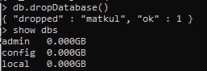

# Tugas_16_MySQL

### 1. Buat database dengan nama matkul dan insert 5 buah data yang jika ditampilkan akan seperti gambar dibawah ini!


```mongodb
use matkul;
```


```mongodb
db.matkul.insertMany( [
      { matkul:"Algoritma & Pemrograman", kode_matkul:"1234567", nama_dosen:"Jamal Kosasih" },
      { matkul:"Rekayasa Perangkat Lunak", kode_matkul:"1234568", nama_dosen:"Ivan Bagus" },
      { matkul:"Sistem Basis Data",  kode_matkul:"1234569", nama_dosen:"Anida Nur Afika"},
      { matkul:"Pengantar Ilmu Komputer",  kode_matkul:"1234561", nama_dosen:"Nico Ariesto"},
      { matkul:"Bahasa Indonesia",  kode_matkul:"1234562", nama_dosen:"Fifi Meilani"}
   ] );
```


### 2. Ubah nama_dosen menjadi Sekar Wandansari untuk kode_matkul = 1234562.
```mongodb
db.matkul.update(
   { kode_matkul: "1234562" },
   {
     $set: { nama_dosen:"Sekar Wandansari" },
   }
);
```


### 3. Hapus data nama dosen a/n Jamal Kosasih dan Ivan Bagus dari tabel matkul!
```mongodb
db.matkul.remove(
       { "nama_dosen":"Jamal Kosasih" }
);
```

```mongodb
db.matkul.remove(
       { "nama_dosen":"Ivan Bagus" }
);
```


### 4. Hapus database matkul!
```mongodb
db.dropDatabase()
```


